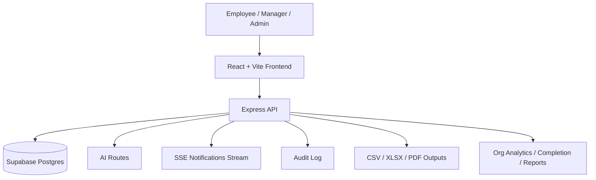
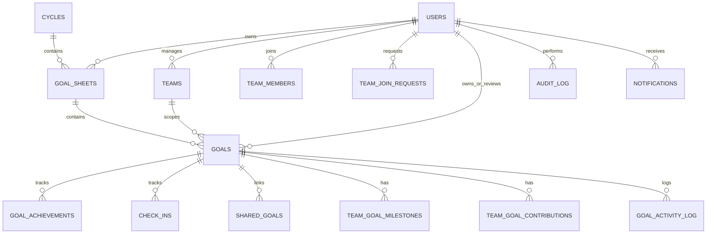

# GoalKeeper
## Judge-Ready Website Description, Architecture, and Demo Guide

GoalKeeper is a web-based goal setting and performance tracking portal built to solve the exact problems described in the AtomQuest hackathon brief: fragmented goal tracking, poor visibility into employee progress, inconsistent manager review flows, and weak auditability across goal cycles.

This implementation turns that problem into a working SaaS-style product with:
- Employee goal sheets
- Manager review and check-in workflows
- Admin governance and reporting
- Multi-team support
- Team goals with milestones, contributions, and activity logs
- Shared goals with synced progress
- Analytics, reports, audit trails, and escalation signals

Everything in this document is based only on what is implemented in the current codebase.

---

## 1. Problem Statement Fit

The AtomQuest brief asks for a portal that allows employees to create goals, managers to approve and review them, and admins to oversee completion and governance. GoalKeeper addresses that with a complete role-based workflow:

- Employees create and submit goal sheets during the active cycle.
- Managers review direct reports, approve or return goal sheets, and add check-in feedback.
- Admins monitor completion, review audit trails, manage users, and inspect org-wide analytics.

The codebase also supports the hard parts that usually break demos:
- Weightage validation
- Goal locking
- Quarterly cycle enforcement
- Shared goals
- Check-in capture
- Audit logging
- Team-level goal tracking

---

## 2. What The Website Does

GoalKeeper is an internal performance governance portal for organizations that want a structured way to manage employee goals and team goals.

It helps teams:
- Define goals with title, thrust area, UoM, target value, and weightage
- Track actual progress during quarterly check-ins
- Review and approve goals before they become locked
- Manage multiple teams under one manager
- Create team goals with milestones and contribution ownership
- Share goals across employees and keep progress synced
- Export reports and view performance summaries
- Review audit logs and escalation signals

---

## 3. Roles And Access

### Employee
- Create and edit their own goals before submission
- View their own goal sheet
- Submit goal sheet for approval
- Record quarterly actuals and status updates
- Download performance summary PDF
- Request to join a team
- View team memberships and join request status

### Manager
- View team goal sheets for direct reports
- Approve or return goal sheets
- Add manager check-in comments
- Manage multiple teams
- Create, edit, and delete team goals
- Review pending team join requests
- Generate AI-assisted check-in comments
- View team analytics and progress

### Admin
- View organization-wide completion and analytics
- Inspect audit logs and audit replay
- Export CSV/XLSX reports
- Deactivate and reactivate employee accounts
- Directly add employees to teams
- Review team join requests
- View org alignment and goal cascade
- Trigger escalation evaluation
- Reset seeded demo data

---

## 4. Core Implemented Features

### 4.1 Goal Management
- Create goal sheets for the active cycle
- Add individual goals
- Add team-scoped goals
- Edit goals before lock
- Delete goals before lock
- Validate:
  - total weightage
  - minimum weightage
  - maximum goals per sheet
  - locked sheet restrictions

### 4.2 Team Goals
- Create team goals
- Edit team goals
- Delete team goals
- View team goal analytics
- Track team goal completion percentage
- Assign a goal owner
- Set priority, visibility, deadline, and lifecycle status
- Attach milestones and contributions
- View team goal activity logs

### 4.3 Shared Goals
- Assign a shared goal to multiple employees
- Keep one primary owner
- Sync linked goal records
- Restrict linked goals to weightage changes only

### 4.4 Check-ins
- Employee quarterly actual submission
- Status tracking for goals
- Manager check-in comments
- AI-assisted check-in comment generation

### 4.5 Team Management
- Create and manage multiple teams per manager
- View members and pending join requests
- Approve or reject join requests
- Remove team members
- Add employees to teams from admin view

### 4.6 Reporting And Analytics
- Completion dashboard
- Org-wide analytics
- Goal distribution analytics
- Manager effectiveness analytics
- Audit log and replay
- CSV and XLSX exports
- Performance summary PDF

### 4.7 Governance And Security
- JWT-based auth
- Role-based route guarding
- Rate limiting
- Helmet security headers
- CSRF token enforcement for write actions
- Sanitized text inputs in key team-goal routes
- Deactivated users blocked from auth

---

## 5. Architecture Overview



### Frontend
- React + TypeScript + Vite
- Role-aware routing
- Responsive dashboard and modal-driven workflows
- Team management and goal management views
- Reusable components for goal creation, check-ins, reports, and org alignment

### Backend
- Express routes organized by domain
- Separate logic for auth, goals, teams, admin, check-ins, reports, AI, and notifications
- Shared validation and helper services
- Server-sent events for notification streaming

### Data Layer
- Supabase Postgres
- Additive schema for teams and enterprise team-goal data
- Audit-first design

---

## 6. Data Model

### 6.1 Main Entities



### 6.2 Implemented Tables

| Table | Purpose |
|---|---|
| `users` | Authentication identity and role |
| `cycles` | Quarterly goal cycle window |
| `goal_sheets` | Employee goal sheet for a cycle |
| `goals` | Goal records, including team-scoped goals |
| `teams` | Manager-owned teams |
| `team_members` | Active and removed team memberships |
| `team_join_requests` | Employee team join flow |
| `goal_achievements` | Quarterly actuals and computed score |
| `check_ins` | Manager check-in state and comments |
| `shared_goals` | Linked shared goal records |
| `audit_log` | Append-only action history |
| `escalation_rules` | Escalation configuration |
| `escalation_events` | Triggered escalation records |
| `ai_telemetry` | AI usage telemetry |
| `team_goal_milestones` | Team goal milestones |
| `team_goal_contributions` | Contribution split by member |
| `goal_activity_log` | Team goal activity trail |
| `notifications` | In-app notification queue |

### 6.3 Goal Schema Fields

The codebase implements these important goal-related fields:
- `goal_sheet_id`
- `team_id`
- `owner_id`
- `title`
- `uom_type`
- `target_value`
- `weightage`
- `thrust_area`
- `description`
- `priority`
- `goal_status`
- `visibility`
- `deadline`
- `completion_pct`
- `blocked_reason`
- `archived_at`

### 6.4 Team Goal Support Fields

Implemented team-goal support includes:
- Team ownership
- Goal owner assignment
- Milestones
- Contribution percentages
- Activity log
- Notifications

---

## 7. How It Solves The Hackathon Brief

### Goal creation and approval
- Employees can create goals for the current cycle.
- Goals are validated before submission.
- Managers can review and approve or return goal sheets.
- Approved sheets become locked.

### Quarterly achievement tracking
- Employees submit actuals during check-in.
- Managers add check-in feedback.
- Goal progress is visible through scores and status.

### Shared goals
- Shared goals are supported with linked goal records.
- Progress sync is preserved through shared goal mapping.

### Governance
- Audit logs capture major actions.
- Completion dashboards and exportable reports help HR/admin teams.

### Team operations
- Managers can own multiple teams.
- Team goals are managed end-to-end.
- Join requests and team membership actions are supported.

---

## 8. Walkthrough

### Employee Walkthrough
1. Log in as `employee@goalkeeper.com`.
2. Open `My Goals`.
3. Create a goal with title, thrust area, UoM, target, and weightage.
4. Submit the goal sheet once individual weightage totals 100%.
5. Open a team page and view team goals if assigned.
6. During check-in, enter actual values and submit progress.
7. Generate a performance summary PDF.

### Manager Walkthrough
1. Log in as `manager@goalkeeper.com`.
2. Open `Team Goals` and review direct reports.
3. Approve or return goal sheets.
4. Open a team detail page.
5. Create or edit team goals.
6. Review pending join requests.
7. Add manager check-in comments.
8. View team analytics and goal progress distribution.

### Admin Walkthrough
1. Log in as `admin@goalkeeper.com`.
2. Open `Admin` views for user management and reports.
3. Review completion dashboards and exports.
4. Inspect audit logs and audit replay.
5. Add employees to teams or deactivate accounts.
6. Trigger escalation evaluation.
7. View org alignment and company goal cascade.

---

## 9. Demo Credentials

All demo accounts use the password:

```text
Demo@1234
```

### Employee Demo Mail
- `employee@goalkeeper.com`
- `priya@goalkeeper.com`
- `ravi@goalkeeper.com`

### Manager Demo Mail
- `manager@goalkeeper.com`

### Admin Demo Mail
- `admin@goalkeeper.com`

---

## 10. Judge-Focused Notes

What stands out in the implementation:
- It is role-based, not a single shared demo flow.
- Team management is real, not a visual stub.
- Goal weightage and lock behavior are enforced.
- Shared goals and team goals are separately modeled.
- Admin reporting is grounded in live data.
- The product feels like an internal SaaS tool, not a UI mock.

What remains intentionally out of scope for this version:
- Microsoft Entra ID SSO
- Email delivery infrastructure
- Real WebSocket presence layer
- ML-based forecasting

---

## 11. Future Plans

These are planned improvements, not current functionality:

- Microsoft Entra ID integration for enterprise SSO
- Better notification delivery beyond in-app stream
- Additional bug fixes and refinement of edge-case UX
- Further bundle splitting and performance tuning
- Broader enterprise audit and permission controls
- More advanced real-time collaboration patterns
- Expanded team-goal reporting and drill-down analytics

---

## 12. Product Positioning

GoalKeeper is positioned as a practical enterprise-ready goal governance portal for organizations that need:
- clear ownership
- structured performance workflows
- auditability
- manager review controls
- team-level execution visibility

The product avoids gimmicks and focuses on reliable execution, traceable workflows, and decision-grade visibility.

